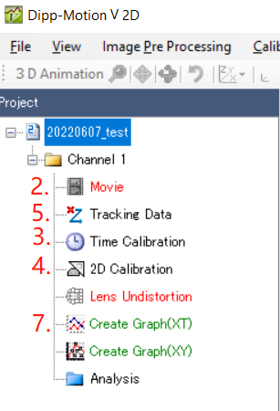
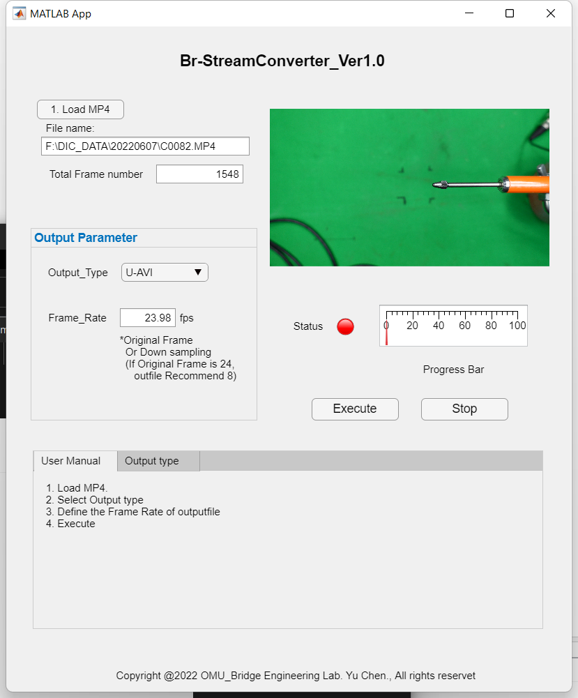
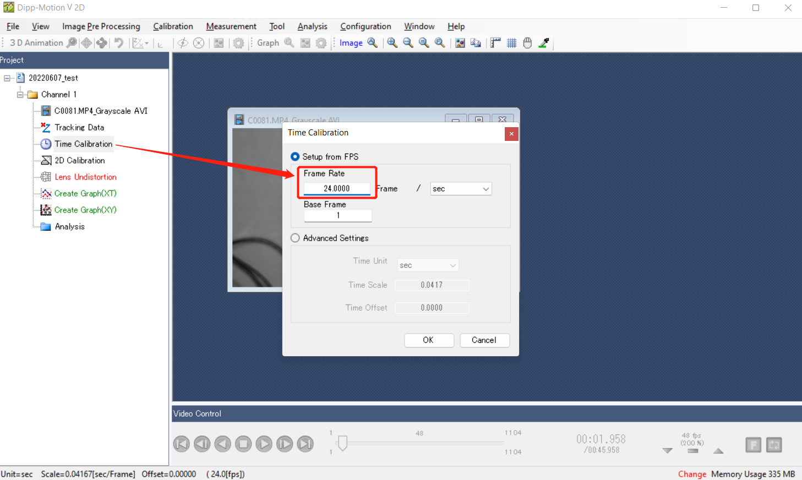
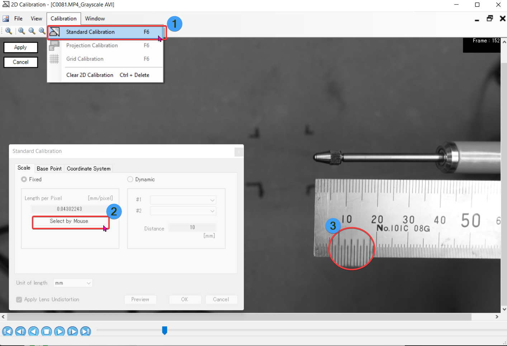
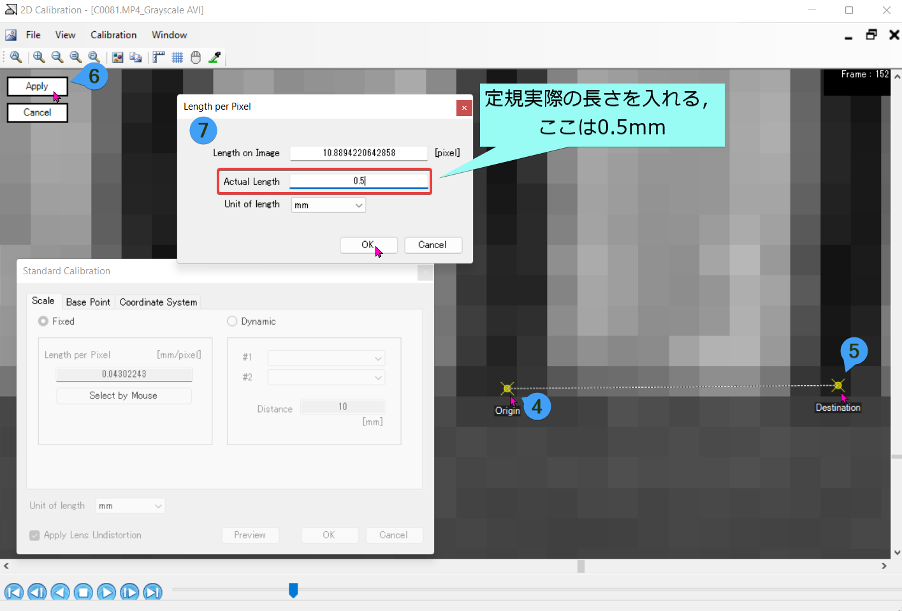
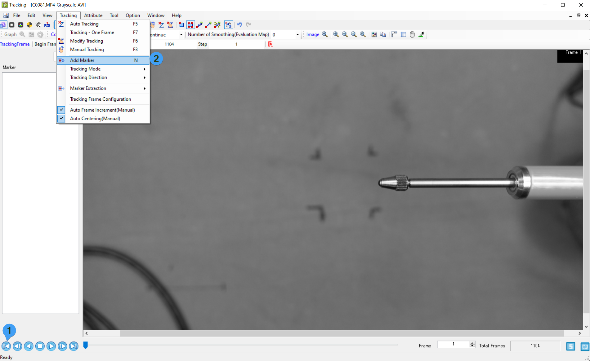
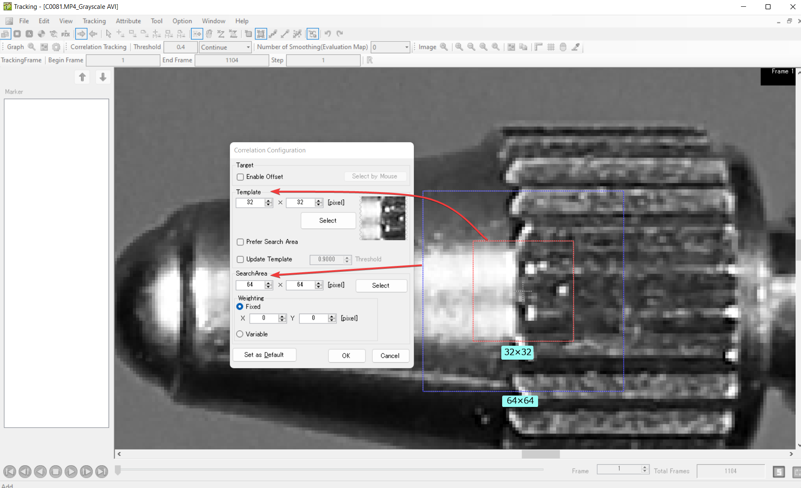
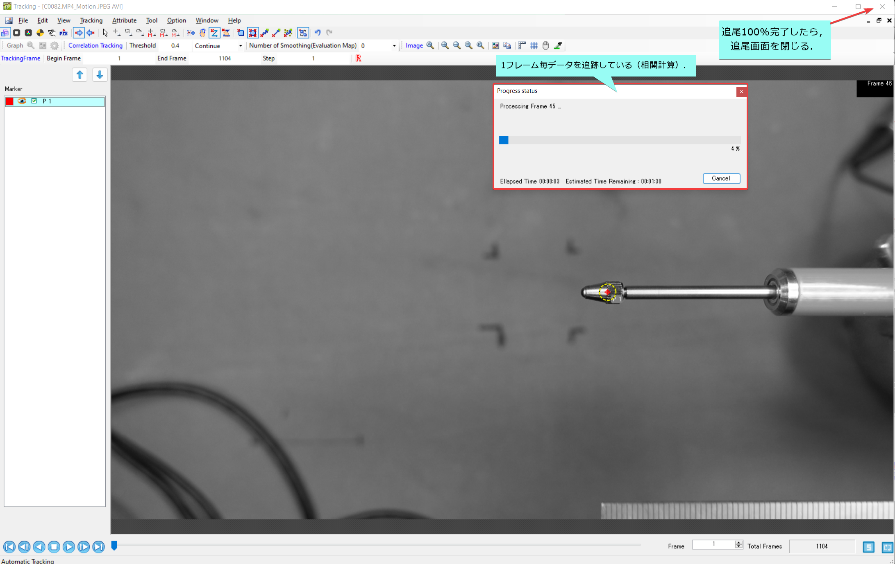
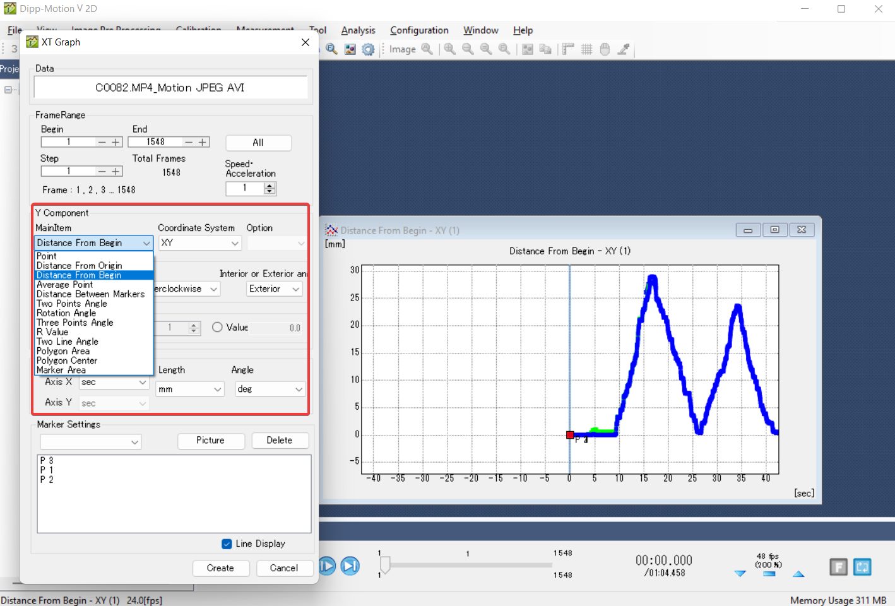
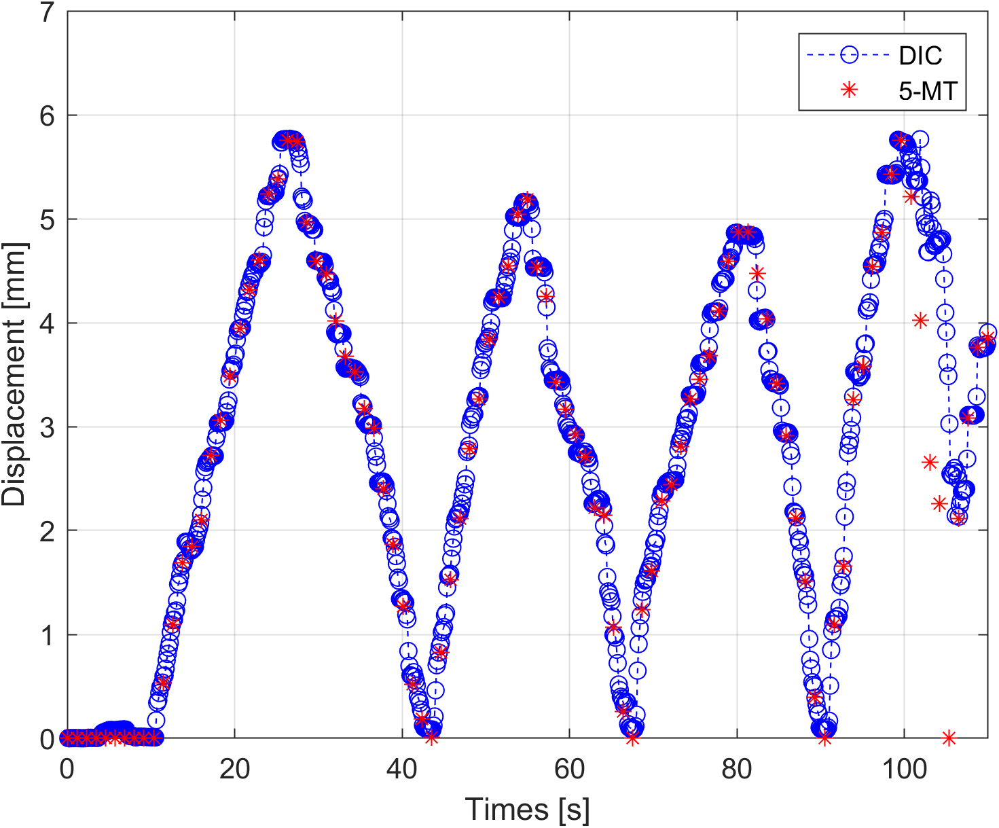

# 目次

-[画像相関法の原理](index.html)  
-[変位計測方法](dic-disp.html)

# 変位計測方法

## カメラの設定（撮影）

**推奨設定：**

|**メニュー項目**|詳細|説明|
|---|---|---|
|**記録方式**| `XAVC S 4K`|　4K解像度（3840×2160）で記録できます|
|**記録設定**| `24P 100M`　Or `30P 100M` | 3840×2160（24p）で撮影する|
|**露出モード**|マニュアル露出|露出（シャッタースピードと絞り）を手動設定する。
|**露出モード**|シャッタースピード優先|シャッタースピードを手動設定する.　|
|**手ブレ補正**| `OFF` | 三脚を利用するときは、［切］にする|
|**フォーカスモード**| `マニュアルフォーカス`|ピント合わせを手動で行う|

> **絞り**，**ISO感度**，**シャッタースピード**　は静止画の設定を参考にしてください．

## 撮影手順

1. カメラ・ライトを設置する（逆光を避けること）．
2. カメラを設定し，ピントを合わす．
3. データロガー，カメラの撮影を同時に起動する．
4. 定規を被写体の横に付ける．（画像のキャリブレーション）
5. 載荷を始まる
6. 終了，測定データを保存する．（データロガー，カメラ）

## 動画処理手順

1. 動画の前処理（詳細は以下に示す）
2. DICソフトを開く，動画を導入する．
3. [時間のキャリブレーション（動画のフレームレートFPSを入れる）](#時間キャリブレーション)．
4. [画素距離のキャリブレーション](#距離2dキャリブレーション)（定規の`0.5` or `1`mm を指定する）
5. [追尾項目で被写体にマーカを設置する](#マーカ)
6. 自動追尾開始
7. [データを出力](#データの出力)
8. データ整理

### 動画の前処理

動画変換APPはGroupBが作ったものを使用するのは推奨する．→[Downloads](https://github.com/ChenYu-K/Data-Processing/raw/main/DIC/Br-StreamConverter_resources/Br-StreamConverter.mlappinstall)


<!-- tab Output Type -->

アプリは現在四つの出力タイプを設置しています．それは：

- **U-AVI**: 非圧縮のAVIファイル（Uncompressed AVI）　　
- **U-AVI+Grayscal**: グレースケール処理非圧縮のAVIファイル（サイズはU-AVIより1/3になる）　　
- **MJPEG**: Motion JPEG AVI（圧縮されたAVIファイル）　　
- **MJPEG+Grayscal**: グレースケール処理Motion JPEG AVI（圧縮されたAVIファイル）
　　
<!-- endtab -->

<!-- tab FrameRate -->

デフォルトは動画を撮影した時のフレームレートです．

> コードの問題なので，Downsamplingする時，デフォルトのFPSから整除できるFPSを指定してください．
例えば，デフォルトFPSが24の場合，24/3=8にすると，8fpsになります．

<!-- endtab -->




　DIC付けている変換ソフトは　`Downsampling`, `FPSの指定`，`圧縮，グレースケール`などの機能はないため，そのまま非圧縮AVIに変換すると莫大な容量を使用する．


### 時間キャリブレーション

時間キャリブレーションを開いて，動画のフレームレートを入れる．

### 距離2Dキャリブレーション

> ピクセルの実際の距離を測定するために，2Dキャリブレーションを行う．

1. 標準的な2Dキャリブレーションを行う．F6キーを押す．
2. 距離はマオスで指定する．
3. 定規の距離を指定する．
7. 実際の距離を入れる．ピクセル距離は自動で換算してくれる．
8. 確定し，画面と閉じてデータを適用され，キャリブレーションを終了する．

**距離を指定する**

### マーカ

1. 変位計測点にマーカを設置する（追尾モードは相関追尾に設定）．
2. 相関のテンプレート範囲及び探索範囲を指定する．
3. 自動追尾を開始する．

テンプレート範囲及び探索範囲の設定．
相関計算のメカニズムは,[相関計算原理](index.html#計算例)まで参考してください．

**自動追尾**

DICは１フレームごとに追尾を行う．追尾が100%になったら，追尾を終了し，画面を閉じる．

### データの出力

今回は一個の点の絶対移動量を取得したいため，　　
XY座標系における最初からの距離を選択した．

## 妥当性

- 星型 * は変位計5-MTのデータロガーから出力した時系列データ．
- 〇の点線はDICから出力したデータ．



　ほとんどのデータロガー出力値はDICの点線に載せているため，DICの計測データは妥当であることを確認できた．




## 注意事項


-  テンプレート範囲は一回だけで上手く設定できない可能性があるので，特徴のある範囲を参考しながらテンプレート及び探索範囲の設定は試行錯誤する必要の場合がある．
-  データロガーの出力は地域の電源周波数の関係で，絶対に1秒間に出力できるわけではない．ちゃんとデータロガーで時間を $㎲$　以下の単位で出力してください．（関西は60Hz[^1]）
- カメラと被写体の距離が近すぎると，被写体が移動したら，被写体とカメラの．よって，特徴量も変わる可能性があり，追尾が失敗する可能性もある．

[^1]: [電源周波数地域（50Hz地域／60Hz地域）について](https://jp.sharp/support/info/info_hz_1.html)