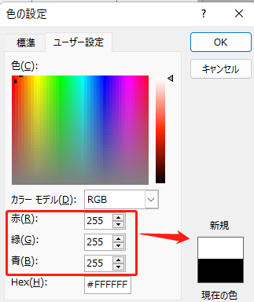


DICソフトDownloads: `\\NAS_sy21\common\便利グッズ\03.software\画像解析20211207\setup.exe`


# 目次

-[画像相関法の原理](#画像相関法の原理)  
-[変位計測方法](#変位計測方法)

# 画像相関法の原理

## 相関とは

相関値(r)の計算式

$$\begin{equation}
\begin{aligned}
&r=\frac{S_{x y}}{S_{x} S_{y}} \\
&=\frac{\frac{1}{n} \sum_{i=1}^{n}\left(x_{i}-\bar{x}\right)\left(y_{i}-\bar{y}\right)}{\sqrt{\frac{1}{n} \sum_{i=1}^{n}\left(x_{i}-\bar{x}\right)^{2}} \sqrt{\frac{1}{n} \sum_{i=1}^{n}\left(y_{i}-\bar{y}\right)^{2}}}
\end{aligned}\end{equation}$$

仮にある画像ピックセルを以下のようなマトリクス**輝度場**を変換する．画像A～Bの中にテンプレート画像と最も類似する画像を探す．


テンプレート画像と画像Bの相関係数が１となり，画像Aの相関係数rは0.5[^1]．

式の解釈 [^2]：  
1. それぞれの変数の平均値を求める  
2. 変数の偏差(平均値を引いた値)を求める  
3. 変数の標準偏差(分散の正の平方根)を求める.  
4. 偏差の積の平均(共分散)を求める  
5. 共分散をそれぞれの標準偏差で割る  
6. 相関係数が得られる  

## 画像相関法の計算方法



目で見るは，パソコンで見ると一連の数字となる．それは輝度と呼ぶ．
全ての色は輝度値で表し，画像処理するとき計算できる．
例えば，(0,0,0)は黒，(255,255,255)は白，(255,0,0)
(255,0,0)は<span style="color:rgb(255, 0, 0);">赤</span>

```html
<span style="color:rgb(255, 0, 0);">赤</span>
```



この図を示すように，色をRGBそれぞれの輝度の組み合わせで表せる．　　

また，一つ画像のピックセルを輝度値で表すと，3次元の輝度場になる．
画像をグレースケールに変換すれば3次方程式から1になるため，計算速度は非常に早くなる．
画像からグレースケール輝度場に変換イメージは以下になる．




> SAD(Sum of Absolute Difference)

画素の輝度値の差の絶対値を求め、その和を求めます。2つの領域が類似するほど値が小さくなる。

$$\begin{equation} SAD=\sum_{y} \sum_{x}|A(x, y)-B(x, y)| \end{equation}
$$

>SSD(Sum of Squared Difference)

画素の輝度値の差の二乗を求め、その和を求めます。2つの領域が類似するほど値が小さくなる。

$$\begin{equation} SSD=\sum_{y} \sum_{x}(A(x, y)-B(x, y))^{2} \end{equation}
$$

>NCC（Normalized Cross Correlation）

正規化相互相関。分子では、輝度値の内積から、似た画像では内積の値が大きくなる。分母では、分子の数値を**正規化**する。2つの領域が類似するほど値が大きくなり、最大＝１、最小＝0。

$$\begin{equation} NCC=\frac{\sum_{y} \sum_{x} A(x, y) B(x, y)}{\sqrt{\sum_{y} \sum_{x} A(x, y)^{2} \sum_{y} \sum_{x} B(x, y)^{2}}}\end{equation}
$$

>ZNCC（Zero means Normalized Cross Correlation）

補正NCC。2つの画像の明るさが同じであれば、NCCで相関値が求めらるが、2つの画像の明るさが違ってくると、画素の輝度値が異なるため、同じ画像でも相関値が異なってししまう。  
そこで、2つの領域の輝度値の平均をそれぞれ引くことで、明るさの違いを補正する役割を果たす．
$$\begin{equation}
ZNCC=\frac{\sum_{y} \sum_{x}(A(x, y)-\bar{A})(B(x, y)-\bar{B})}{\sqrt{\sum_{y} \Sigma_{x}(A(x, y)-\bar{A})^{2} \sum_{y} \Sigma_{x}(B(x, y)-\bar{B})^{2}}} \end{equation}
$$

## 計算例


テンプレートマーチング(Template matching)


最初の画素から、1画素づつ移動させて、2つの画像の類似度を探索するものです。






$$I=\left[\begin{array}{cccc}
10 & 12 & 11 & 10 \\
10 & 35 & 26 & 10 \\
11 & 26 & 38 & 10 \\
9 & 11 & 7 & 10
\end{array}\right], T=\left[\begin{array}{cc}
35 & 25 \\
27 & 35
\end{array}\right]$$

テンプレート画像の幅w=2、高さh=2なので、SAD(1, 1)は次のようにして計算でる．
(中心の画像値を例として)

$$\begin{aligned}
SAD(1,1) &=\sum_{x=0}^{1} \sum_{y=0}^{1}|I(1+x, 1+y)-T(x, y)| \\
&=|I(1,1)-T(0,0)|+|I(1,2)-T(0,1)| \\
&+|I(2,1)-T(1,0)|+|I(2,2)-T(1,1)| \\
&=|35-35|+|26-25|+|26-27|+|38-35|=5
\end{aligned}
$$


 入力画像の画像値$\left[\begin{array}{cc}
35 & 26 \\26 & 38\end{array}\right]$の部分の$SAD(1,1)$が最少となり，テンプレート画像$\left[\begin{array}{cc}
35 & 25 \\27 & 35\end{array}\right]$と最も類似していることを言える． 

> **次は相関法で計算してみる．**　　

　実際のDICはZNCCを用いてテンプレート画像を探索している（テンプレートマーチング）．相関が1に近いほど相関が高いと言える．計算方法は以下になる．

$$
\begin{aligned}
ZNCC(1,1)&=\frac{\sum_{y} \sum_{x}(I(x, y)-\bar{I})(T(x, y)-\bar{T})}{\sqrt{\sum_{y} \Sigma_{x}(I(x, y)-\bar{I})^{2} \sum_{y} \Sigma_{x}(T(x, y)-\bar{T})^{2}}}\\
&=\frac{(35-30.5)(35-31.25)+(25-30.5)(26-31.25)+(27-30.5)(26-31.25)+(35-30.5)(38-31.25)}{\sqrt{((35-30.5)^2+(25-30.5)^2+(27-30.5)^2+(35-30.5)^2+)+(26-31.25)^2+(26-31.25)^2+(38-31.25)^2}}\\
&=0.968
\end{aligned}
$$


以下のようにMatlabでも簡単に計算できる．

```MATLAB Matlab
a=[35,25;27,35]
b=[35,26;26,38]
ANS=corrcoef(a,b)
    =0.9683
```

# 変位計測方法

## カメラの設定（撮影）

推奨設定：

|メニュー項目|詳細|説明|
|---|---|---|
|記録方式| `XAVC S 4K`|　4K解像度（3840×2160）で記録できます|
|記録設定| `24P 100M`　Or `30P 100M` | 3840×2160（24p）で撮影する|
|露出モード|マニュアル露出|露出（シャッタースピードと絞り）を手動設定する。
|露出モード*|シャッタースピード優先|シャッタースピードを手動設定する.　|
|手ブレ補正| `OFF` | 三脚を利用するときは、［切］にすると自然な画像になります。|
|フォーカスモード| `マニュアルフォーカス`|ピント合わせを手動で行う|

> **絞り**，**ISO感度**，**シャッタースピード**　は静止画の設定を参考にしてください．

## 撮影手順

1. カメラ・ライトを設置する（逆光を避けること）．
2. カメラを設定し，ピントを合わす．
3. データロガー，カメラの撮影を同時に起動する．
4. 定規を被写体の横に付ける．（画像のキャリブレーション）
5. 載荷を始まる
6. 終了，測定データを保存する．（データロガー，カメラ）

## 動画処理手順

1. 動画の前処理（詳細は以下に示す）
2. DICソフトを開く，動画を導入する．
3. 時間のキャリブレーション（動画のフレームレートFPSを入れる）
4. 画素距離のキャリブレーション（定規の`0.5` or `1`mm を指定する）
5. 追尾項目で被写体にマーカを設置する
6. 自動追尾開始
7. データを出力
8. データ整理
   
### 動画の前処理

動画変換APPはGroupBが作ったものを使用するのは推奨する．→Downloads

　DIC付けている変換ソフトは　`Downsampling`, `FPSの指定`，`圧縮，グレースケール`などの機能はないため，そのまま非圧縮AVIに変換すると莫大な容量を使用する．

   
### 時間キャリブレーション

wait picture

### 距離キャリブレーション

wait picture

### マーカ

### データの出力


# reference
[^1]: MATLABでこの関数を使うと`R = corrcoef(A,B)`，簡単に計算できる．
[^2]: https://jss1.jp/column/column_212/