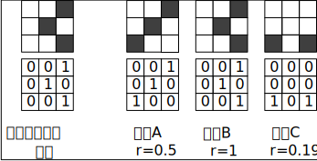
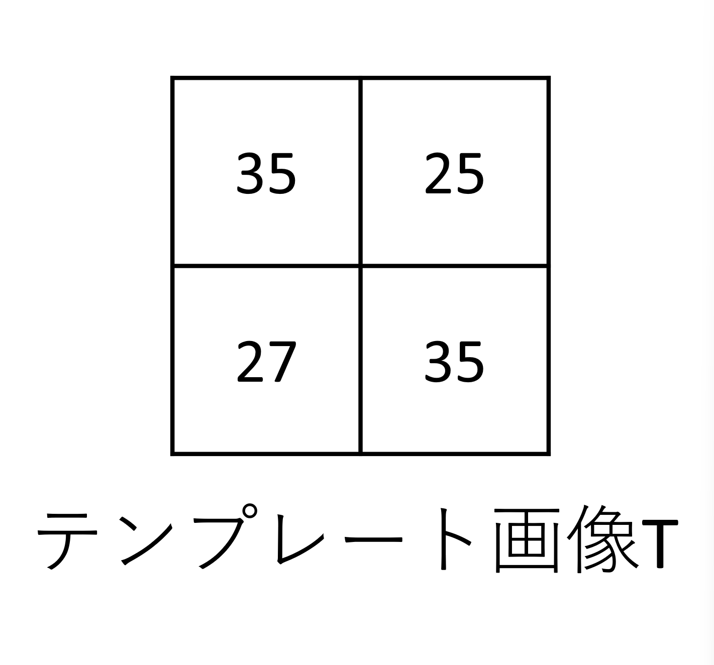
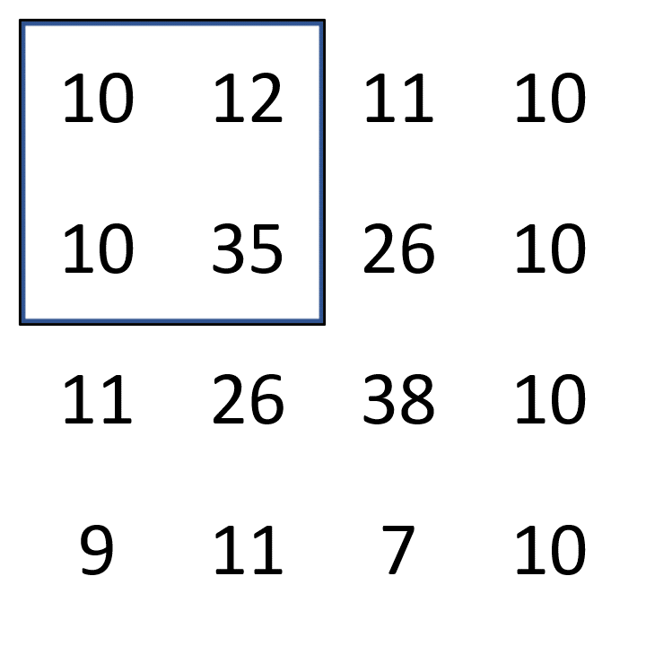

# 相関とは

相関値(r)の計算式

$$\begin{equation}
\begin{aligned}
&r=\frac{S_{x y}}{S_{x} S_{y}} \\
&=\frac{\frac{1}{n} \sum_{i=1}^{n}\left(x_{i}-\bar{x}\right)\left(y_{i}-\bar{y}\right)}{\sqrt{\frac{1}{n} \sum_{i=1}^{n}\left(x_{i}-\bar{x}\right)^{2}} \sqrt{\frac{1}{n} \sum_{i=1}^{n}\left(y_{i}-\bar{y}\right)^{2}}}
\end{aligned}\end{equation}$$

テンプレート画像と画像Bの相関係数が１となり，画像Aの相関係数rは0.5[^1]．

式の解釈 [^2]：  
1. それぞれの変数の平均値を求める  
2. 変数の偏差(平均値を引いた値)を求める  
3. 変数の標準偏差(分散の正の平方根)を求める.  
4. 偏差の積の平均(共分散)を求める  
5. 共分散をそれぞれの標準偏差で割る  
6. 相関係数が得られる  

## 画像相関法の計算方法

> SAD(Sum of Absolute Difference)

画素の輝度値の差の絶対値を求め、その和を求めます。2つの領域が類似するほど値が小さくなる。

$$\begin{equation} SAD=\sum_{y} \sum_{x}|A(x, y)-B(x, y)| \end{equation}
$$

>SSD(Sum of Squared Difference)

画素の輝度値の差の二乗を求め、その和を求めます。2つの領域が類似するほど値が小さくなる。

$$\begin{equation} SSD=\sum_{y} \sum_{x}(A(x, y)-B(x, y))^{2} \end{equation}
$$

>NCC（Normalized Cross Correlation）

正規化相互相関。分子では、輝度値の内積から、似た画像では内積の値が大きくなる。分母では、分子の数値を**正規化**する。2つの領域が類似するほど値が大きくなり、最大＝１、最小＝0。

$$\begin{equation} NCC=\frac{\sum_{y} \sum_{x} A(x, y) B(x, y)}{\sqrt{\sum_{y} \sum_{x} A(x, y)^{2} \sum_{y} \sum_{x} B(x, y)^{2}}}\end{equation}
$$

>ZNCC（Zero means Normalized Cross Correlation）

補正NCC。2つの画像の明るさが同じであれば、NCCで相関値が求めらるが、2つの画像の明るさが違ってくると、画素の輝度値が異なるため、同じ画像でも相関値が異なってししまう。  
そこで、2つの領域の輝度値の平均をそれぞれ引くことで、明るさの違いを補正する役割を果たす．
$$\begin{equation}
ZNCC=\frac{\sum_{y} \sum_{x}(A(x, y)-\bar{A})(B(x, y)-\bar{B})}{\sqrt{\sum_{y} \Sigma_{x}(A(x, y)-\bar{A})^{2} \sum_{y} \Sigma_{x}(B(x, y)-\bar{B})^{2}}} \end{equation}
$$


テンプレートマーチング(Template matching)


最初の画素から、1画素づつ移動させて、2つの画像の類似度を探索するものです。





$$I=\left[\begin{array}{cccc}
10 & 12 & 11 & 10 \\
10 & 35 & 26 & 10 \\
11 & 26 & 38 & 10 \\
9 & 11 & 7 & 10
\end{array}\right], T=\left[\begin{array}{cc}
35 & 25 \\
27 & 35
\end{array}\right]$$

テンプレート画像の幅w=2、高さh=2なので、SAD(1, 1)は次のようにして計算でる．
(中心の画像値を例として)

$$\begin{aligned}
SAD(1,1) &=\sum_{x=0}^{1} \sum_{y=0}^{1}|I(1+x, 1+y)-T(x, y)| \\
&=|I(1,1)-T(0,0)|+|I(1,2)-T(0,1)| \\
&+|I(2,1)-T(1,0)|+|I(2,2)-T(1,1)| \\
&=|35-35|+|26-25|+|26-27|+|38-35|=5
\end{aligned}
$$

 入力画像の画像値$\left[\begin{array}{cc}
35 & 26 \\26 & 38\end{array}\right]$の部分の$SAD(1,1)$が最少となり，テンプレート画像$\left[\begin{array}{cc}
35 & 25 \\27 & 35\end{array}\right]$と最も類似していることを言える． 

# reference
[^1]: MATLABでこの関数を使うと`R = corrcoef(A,B)`，簡単に計算できる．
[^2]: https://jss1.jp/column/column_212/