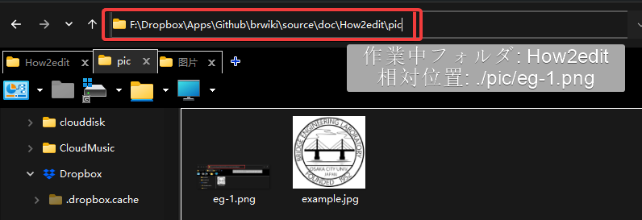

 Hexo/Markdown 書き方 


# まとめ
まず，簡単でまとめると．

|機能|書き方|例|
|---|---|---|
|見出し| # 見出し1 <br> ##見出し2|
|inLineコード| \`code\`|`code`|
|Hyperlink| \[ocubridgeHP](http://brdg.civil.eng.osaka-cu.ac.jp/)|[ocubridgeHP](http://brdg.civil.eng.osaka-cu.ac.jp/)|
|画像挿入|\!\[代替テキスト](URL)| [グラフを挿入する](##グラフを挿入する．) |
|太字|\*\*テキスト**|**テキスト**|
|斜体|\*テキスト*| *テキスト*|
|打消し線|\~~テキスト~~|~~テキスト~~|
|リスト|`- abc`| - abc|
|空行・改行| \半角スペース2つ、<br>など
|コードの挿入|` ```md ` <br> `code`  <br>` ``` ` | Markdown:md <br> Python: py <br> etc...|
|引用| `> abc`| > abc|
|文字色| `<font color="Red">テキスト</font>` | <font color="Red">テキスト</font>|
|水平線|` *** `|***|
|マークダウンのエスケープ| ```  \`abc`  ```| \`abc`


# 書き方

本サイトは [^1]を基づいて`Hexo` [^2]から`Html`に自動変換されたものです．　　
Htmlを触らず，簡単に文書を作成するのは目的なので、基本Htmlのフォーマットは変更できない．　　


サイトの書き方は基本`Markdown`と同じ．[Wikipekia](https://ja.wikipedia.org/wiki/Markdown)を参考してください


## アルゴリズム

1. `Nas_sy21:\web\wiki\source`に置いたものは`HTMEL`のソースコードである．
2. `Hexo`がコンパイルすれば、自動的に`Markdown`の`.md`ファイルを`.html`ファイルに変換できる.
3. 変換したものは`Nas_sy21:\web\wiki\public`においてある．
4. 写真あるいは文書とかを`source`に入れたら、URLで参照したら出てくる．e.g.

```html

```


 
`source`の中にあるものはHtmlの全文であるが，それ以外のフォルダを触らないでください．  


## グラフを挿入する．
　グラフを挿入する方法いくつかがある．最も使われているのは`Markdown`のコード．

```md

```
Htmlコードも使える．

```html

```
### グラフの位置
グラフの場所は**絶対位置**と**相対位置**2種類がある．
`./pic`は相対場所：現在作業中のフォルダ内のPICフォルダを指している．
> `./` は現在のフォルダの相対位置

これ``　を入力すると，以下のようになる．



　他のフォルダ内，あるいはwebsiteのグラフを引用する時，絶対位置を使うのは望ましい．例えば，

`` |``
:-------------------------:|:-------------------------:
|  |  |

>? Local絶対位置を引用する時，本サイトのルートディレクトリは`./source`なので，絶対位置の引用は`source`以降のフォルダからスタート.

## 表の作り方

```md
| Tile1 | Tile2 | Tile3 |
| :------ | :------: | ------: | --- |
| 文字を左寄せ | 文字を中央寄せ | 文字を右寄せ | デフォルト（左）|
```
| Tile1 | Tile2 | Tile3 | Tile4 |
| :------ | :------: | ------: | --- |
| 文字を左寄せ　　 | 文字を中央寄せ　　 | 文字を右寄せ　　 | デフォルト（左）|

# Hexoにエンベデッドされた機能

## Tag

```
 Content (md partial supported) 
```
を使えば次のようなTagを作成できる．
例えば：
```
 これはテスト 
```
 これはテスト 
選択できるものは以下に示す(上記の`class_name`を次のクラスに変更する)：
- `default`
- `primary`
- `success`
- `info`
- `warning`
- `danger`


 これは  `default`  
 これは `primary` 
 これは `success` 
 これは `info` 
 これは `warning` 
 これは `danger` 

Iconなし：
```md

#### Details and summary (No icon)
Note with summary: `note info no-icon This is a summary`

```

#### Details and summary (No icon)
Note with summary: `note info no-icon This is a summary`


## グラフの大きさ調整

```html

```

## Flowchart

Flowchartは`Mermaid` [^3] を使用している．
[Documentation](https://mermaid-js.github.io/mermaid/#/flowchart)

**書き方**

---

```markdown

state if_state <<choice>>
[*] --> if_state:Loop
if_state --> Statements: yes
Statements --> if_state
if_state --> [*]: No]

```


state if_state <<choice>>
[*] --> if_state:Loop
if_state --> Statements: yes
Statements --> if_state
if_state --> [*]: No



# Footnote  

[^1]: [Markdown（マークダウン）は、文書を記述するための軽量マークアップ言語のひとつである.](https://ja.wikipedia.org/wiki/Markdown)  
[^2]: [A fast, simple & powerful blog framework](https://hexo.io/)
[^3]: https://theme-next.js.org/docs/tag-plugins/mermaid.html#Settings