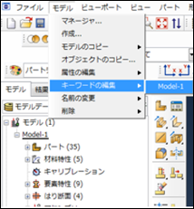
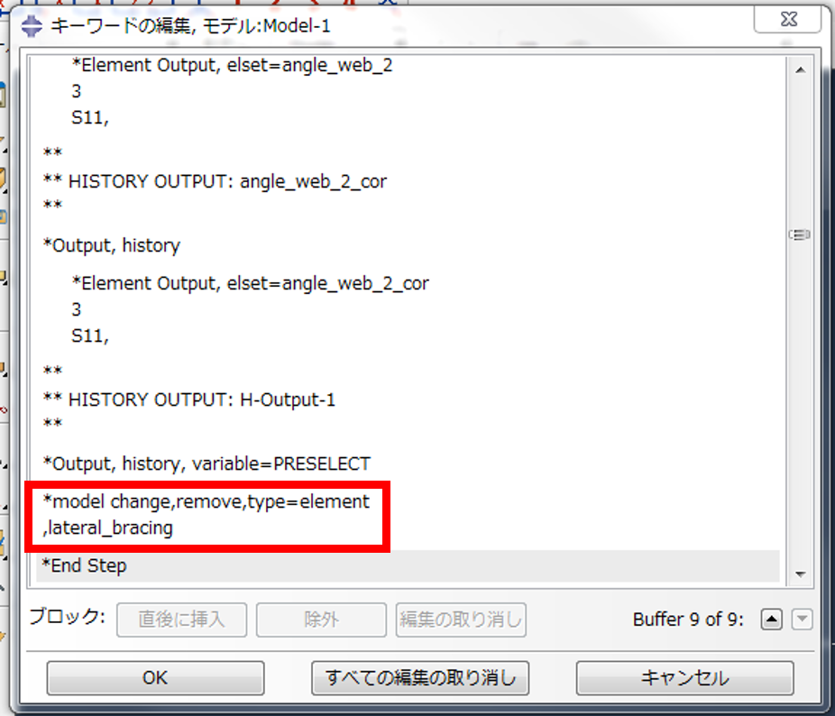
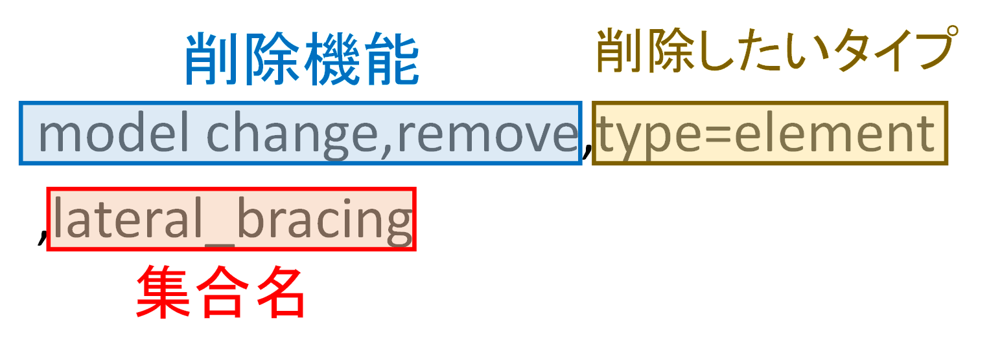
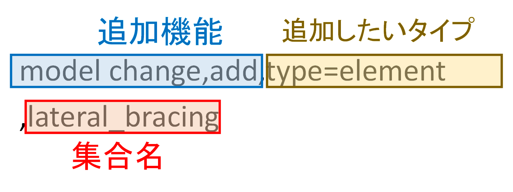
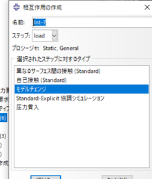
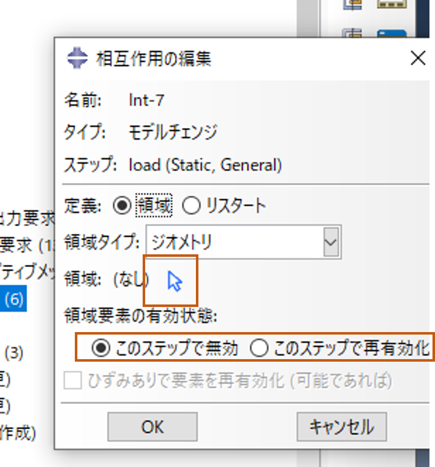
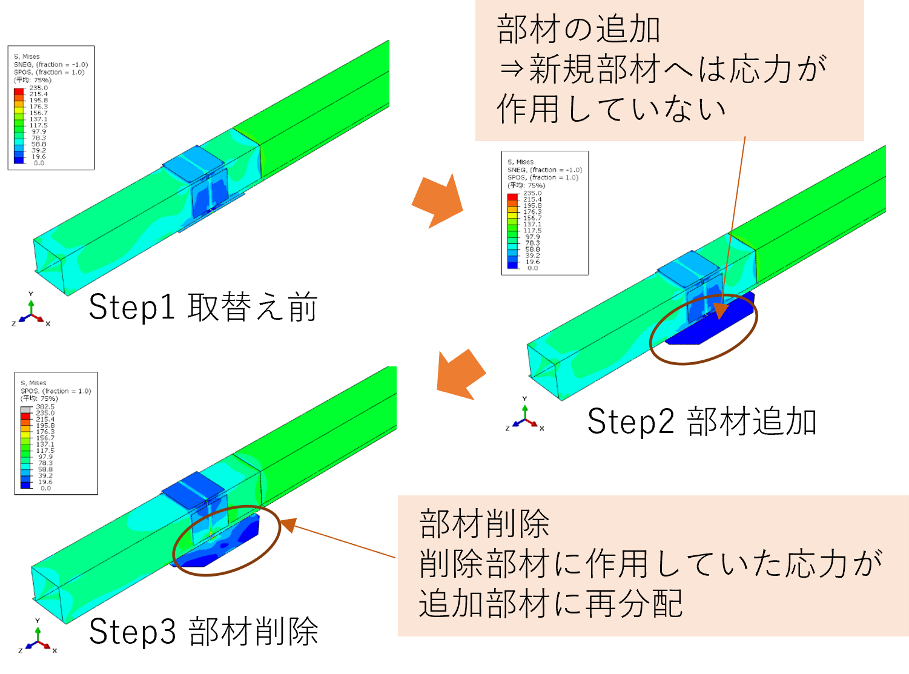

# 要素の除去と追加

解析モデルの一部を一時的に，その時点以降の解析から削除+削除した部分をモデルに戻すことができる

 

## 方法1（キーワード編集による方法）

はじめに集合をつくれば，あとはスクロールしてキーワードを打ちこむだけでできる．ステップ数が多い場合に有効．

 



モデル⇒キーワード編集⇒モデルを選択

 

　

要素の除去・追加を行いたいステップのキーワード欄（図の赤枠）に打ち込むと完了！

※キーワードの書き方

対象とする部分の集合をあらかじめ作成⇒集合名をキーワードに打ち込む

**要素の除去の説明**

一般ステップで，指定した要素をモデルから削除できる．Abaqus/Standardは，削除される直前にそれらの要素が負担していた力/流束を，要素の境界上の接点において保存する．これらの力はステップ修了時にゼロとなるまで，要素削除のステップのなかで線形的に減じられる．したがって，削除される部分がモデルのほかの部分に与える影響は，削除ステップの最終時点で始めて完全に除かれることになる．この逓減方法によって，要素の削除はモデルになめらかな効果を与える．

削除された要素についての計算は，削除ステップの最初の段階から行われなくなる．削除された要素は，以下の方法によって最有効化されるまで，モデルの中から消去される．

 

**入力ファイルでの使用法**

モデルから要素を削除するには，以下のオプションを使用する．

*MODEL CHANGE, TYPE=ELEMENT, REMOVE

 
**注意事項**

要素を追加する場合は一番最初のステップにおいて追加部材を除去する必要がある

 　
 

## 方法2（相互作用による方法）

cae上にて要素を選択することができる．ただしステップごとに作業が必要であるため，ステップ数が多い場合には向かない

 

　

モデルチェンジを行いたいステップにおいて，相互作用を作成⇒モデルチェンジを選択

 



領域⇒削除or追加したい部材を選択

要素を削除したい場合⇒このステップで無効を選択

要素を追加したい場合⇒このステップで最有効化を選択

 

**相互作用で行うメリット**

- 自分でキーワード編集上に打ち込む必要がない．

- あらかじめ集合を作る必要がなく，ビューポート内で選択することができる．

 

## 使用例

**部材取り替え解析**

応力の再分配を考慮できることから，施工ステップ解析（部材取替え解析，ボルト締め）などに使用可能!
