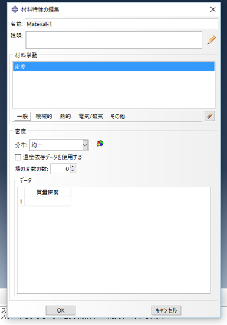
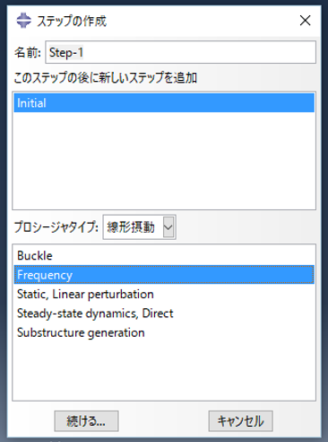
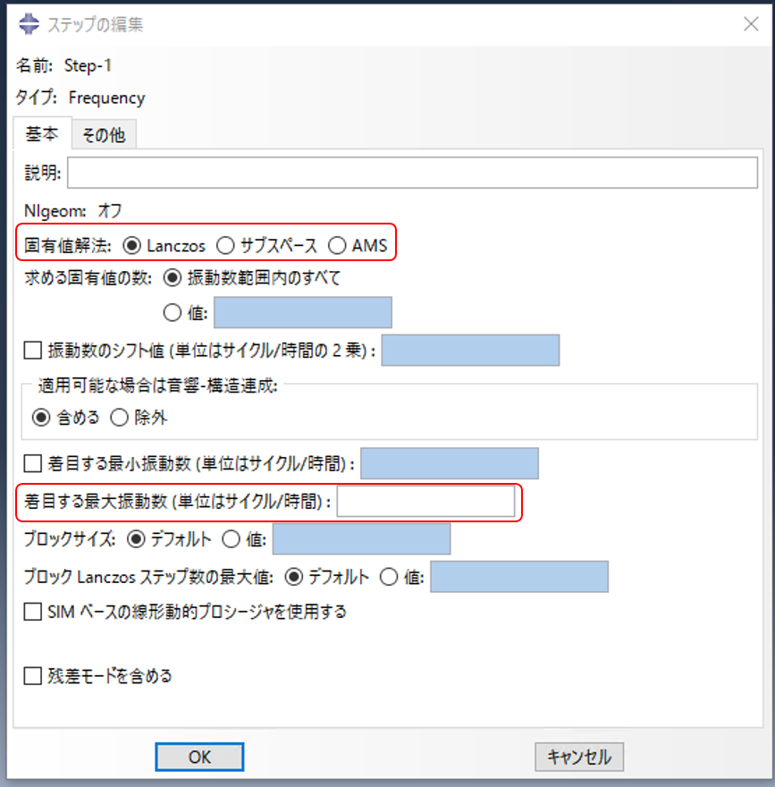
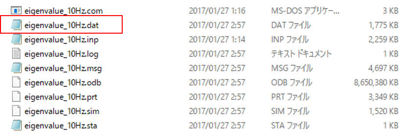
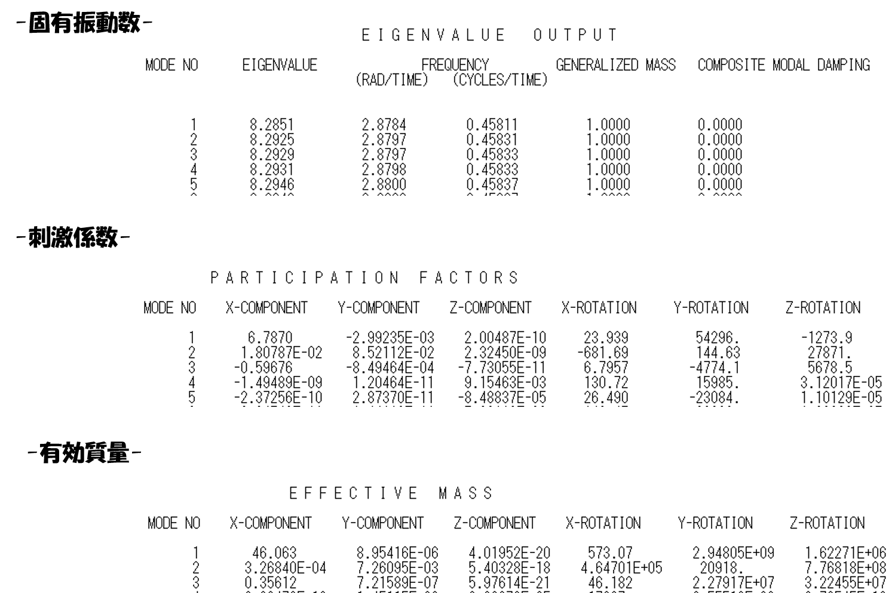
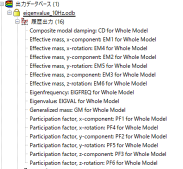
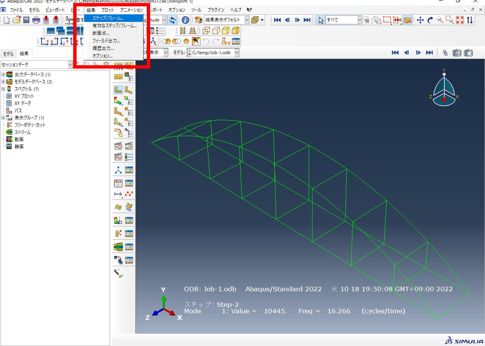
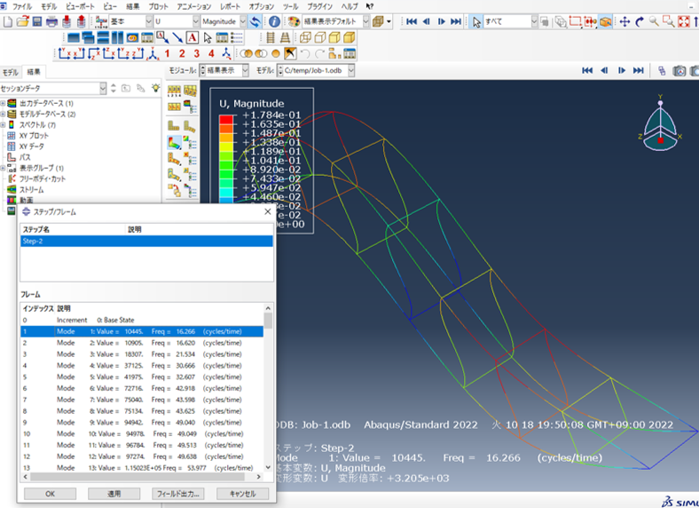

# 固有値解析


解析モデルの固有値・角振動数・固有振動数・刺激係数・有効質量を確認することができる．


## 固有値計算原理

通常，静的解析の運動方程式は，

$$ [k]\{x\}=\{F\} 
$$

動的解析の運動方程式は，
$$
[M]\{\ddot{x}\}+[C]\{\dot{x}\}+[K]\{x\}=\{F\}
$$

と表すことができ，左から，慣性孔，減衰項，剛性項，外力項と呼ぶ．

固有値解析では，外力項と減衰項を０と考え自由振動状態を想定する．

$$
\left([K]-\omega^2[M]\right)\{\phi\}=0
$$

そうすると，固有振動数は，

$$
f=\frac{\omega}{2\pi}
$$

と表すことができる．

## 解析手法



材料特性⇒密度を入力

※ただし，単位は自分で決定する．例）質量㎏・長さm・力N，質量ton・長さmm・力N 等



ステップ⇒線形摂動⇒Freqency



ステップノ編集⇒

・固有値解法⇒Lanczos

・着目する最大振動数⇒自分が見たい最大の振動数


※Lanczosは最も一般的な解法で，計算速度がAMSより遅いが，刺激係数野モーダル有効質量を計算してくれる．


## 結果の見方

Datファイルを確認するか，abaqusないで確認することができる．

＜Datファイル＞

＜abaqus内＞

また，abaqus内では，固有振動数とともにモード形状を見ることができる．

