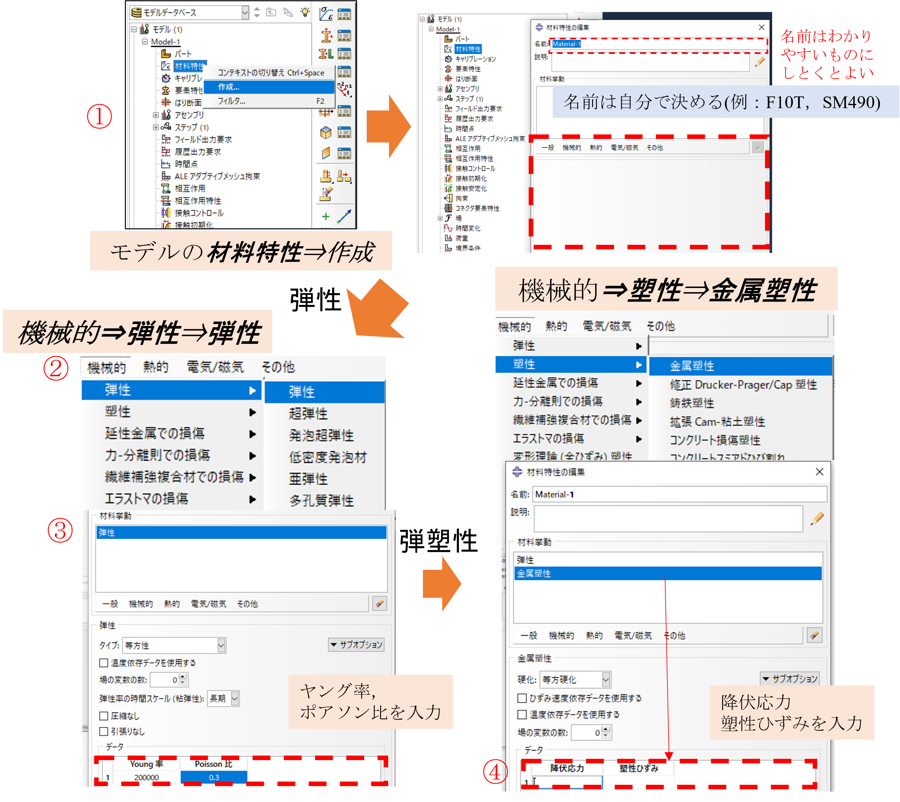
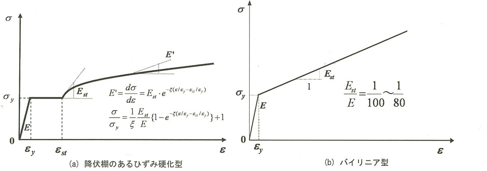
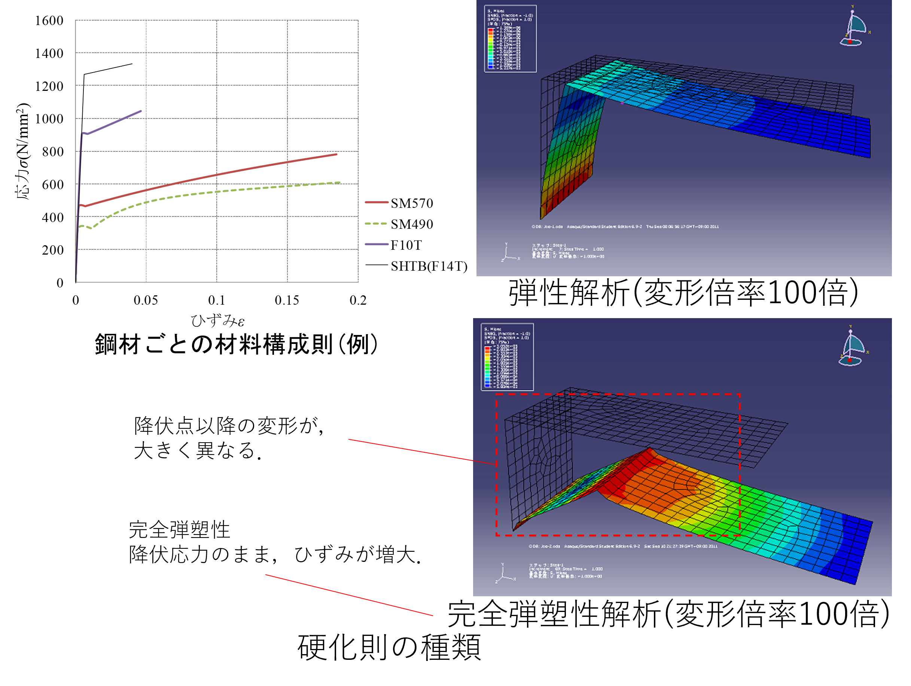

# 材料構成則
---

## 材料構成則とは

物体を構成する物質の力学的特性の数理的表現であり、個体や流流体を連続体に理想化した場合における力と変形との関係を
**応力-ひずみ関係**で表したもの.   

## 弾性解析(材料線形)
応力集中を確認したい時などに使用することが多く，常時𝜎=𝐸𝜀が成り立つ．

## 弾塑性解析(材料非線形)
降伏域の確認，塑性変形後の挙動を確認する場合等に適しており，**降伏点以降のσ-ε関係**が重要．必要に応じて使い分ける.  
実験の材料試験の結果を材料特性に入力する場合もある．
(Excelシートからコピペ可能．実験の値は公称値で与えられる)


## 公称応力
力を構造物の変形前の断面積で割って得られる応力



## 真応力
力を構造物の変形後の断面積で割って得られる応力.  


abaqusでは真応力-真ひずみで構成則を入力しなければならない．

# 鋼材の構成則(弾塑性解析)の種類

## バイリニア型
レベル2地震動に対する耐震設計に際して，時刻歴応答解析に用いる構造用鋼材の構成則として最適
移動硬化則とともに適用されることが多い．
（解析上の利便性を考慮して作成された）
塑性ひずみが5%の範囲までを再現できる．(鋼・合成構造標準示方書(総則編)より)
高力ボルトなどの高張力鋼で伸びが小さい材料に適している．

## 降伏棚のあるひずみ硬化型モデル
弾性域，降伏棚，ひずみ硬化を有する構成則．
バイリニア型のものに比べて大きなひずみ領域まで適用できる．

## 硬化則
多くの材料の降伏条件は、荷重の履歴と塑性ひずみの変化に依存する．
荷重による降伏条件の変化は硬化と呼ばれ、硬化則とはこれを規定したものである．塑性ひずみの進展に伴う降伏曲面の変化の仕方により、弾塑性材料の性質を特徴付けることができる．
(細かい話はゼミAで勉強してください)

