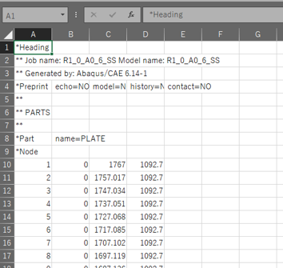
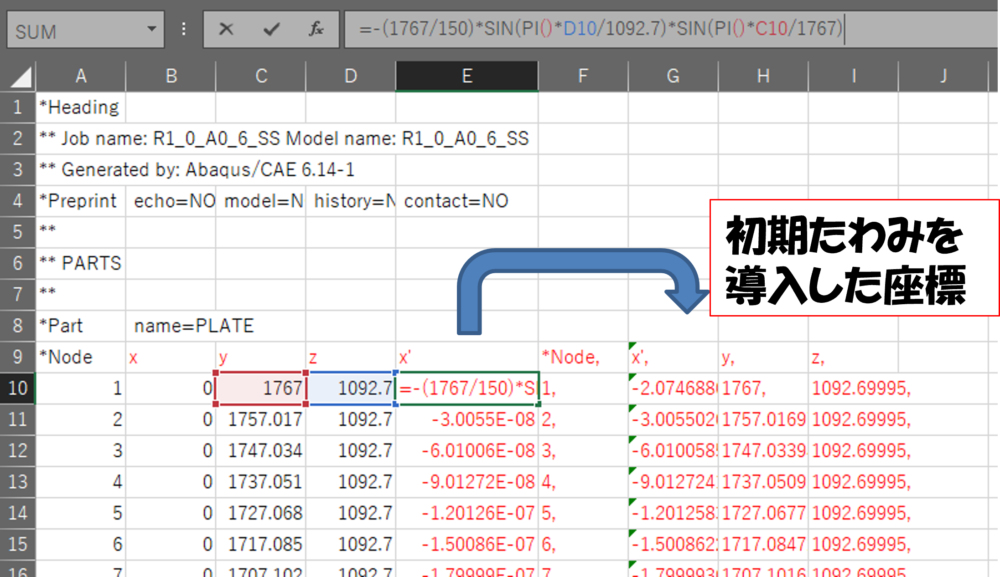
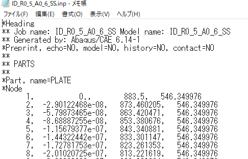
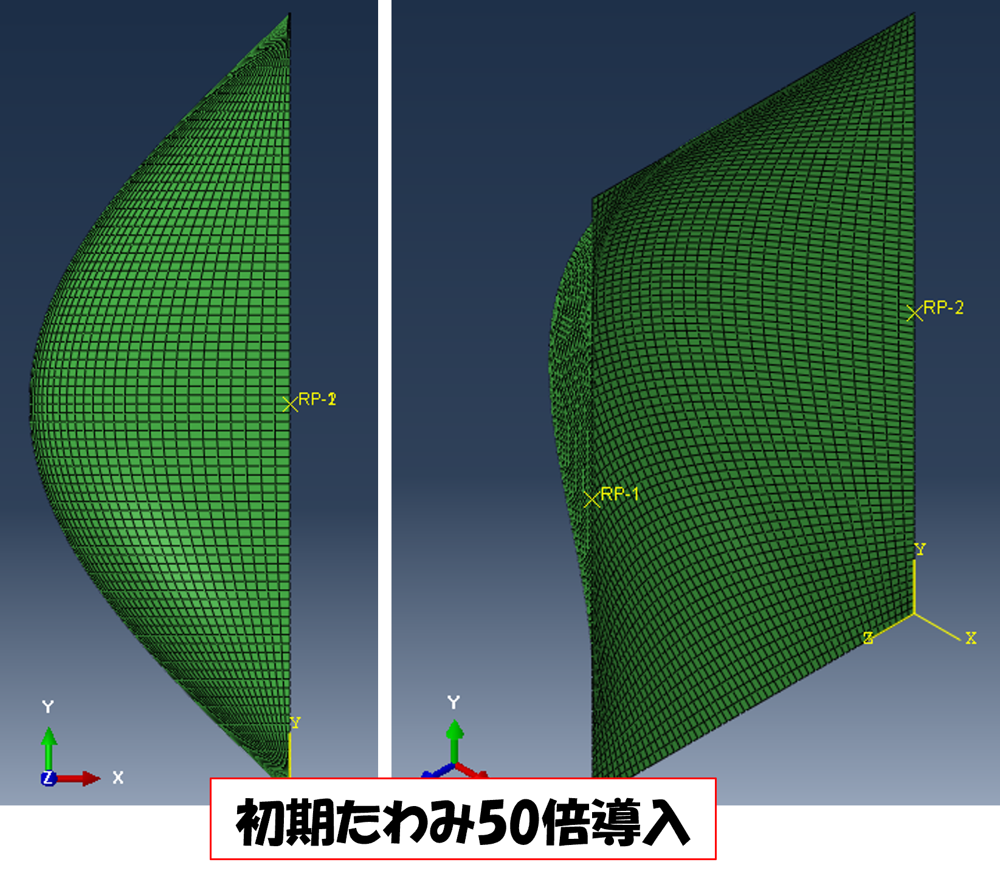

# 初期たわみ導入法

## ①
初期たわみを導入したい解析モデルを作成し，データチェックを行い，inpファイルを出力

## ②
inpファイルをコピーして，新しいinpファイルを作成

## ③
新しいinpファイルを開いて，名前を付けて保存で，拡張子csvに変更

## ④
Excelで初期たわみを導入．
道路橋示方書では以下の式としている
$$
w=\frac{b}{150}\rm{sin}\left(\frac{\pi x}{a}\right)\rm{sin}\left(\frac{\pi y}{b}\right)
$$

## ⑤
csvファイルを，Excelブック形式で保存(数式が残るので)

## ⑥
④で初期たわみ導入した座標をinpファイルにコピー

## ⑦
cae上でファイル-インポート→モデル→inpファイル選択

