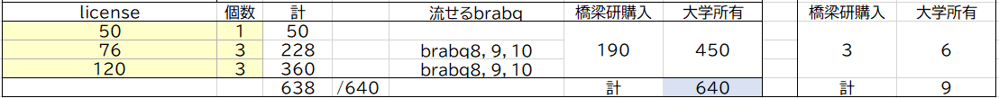
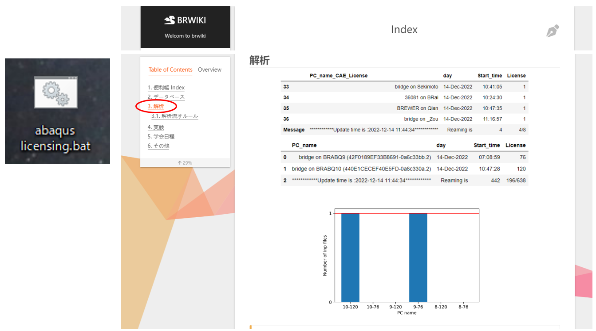
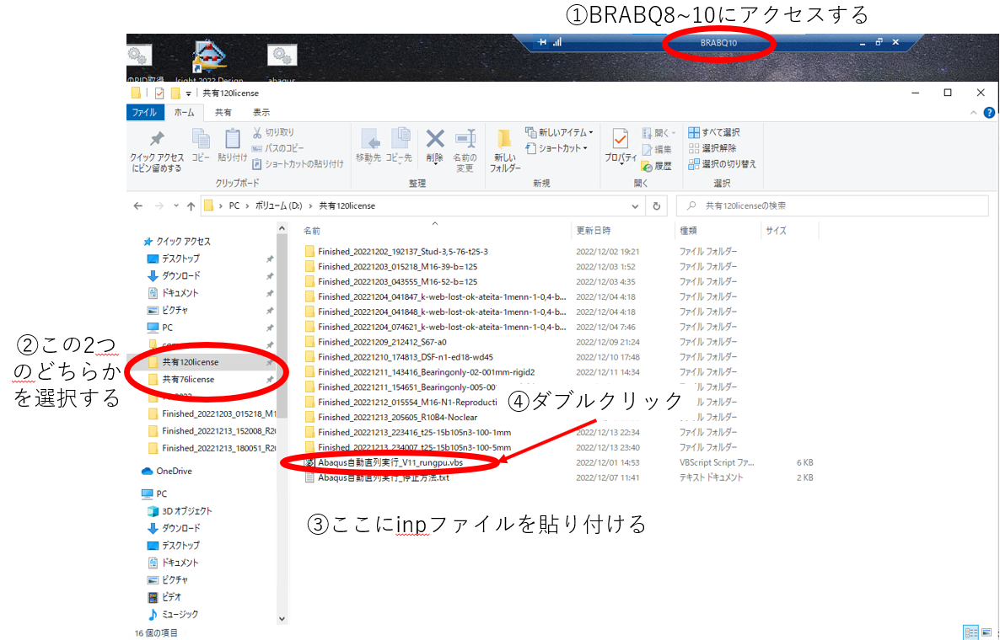
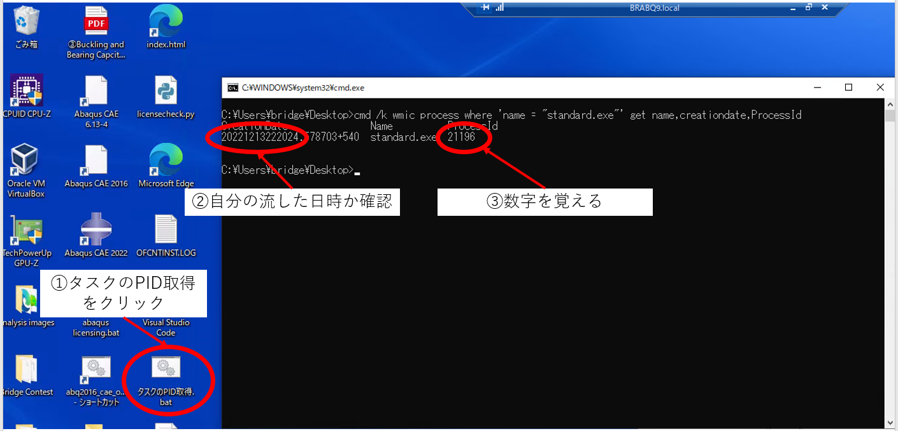
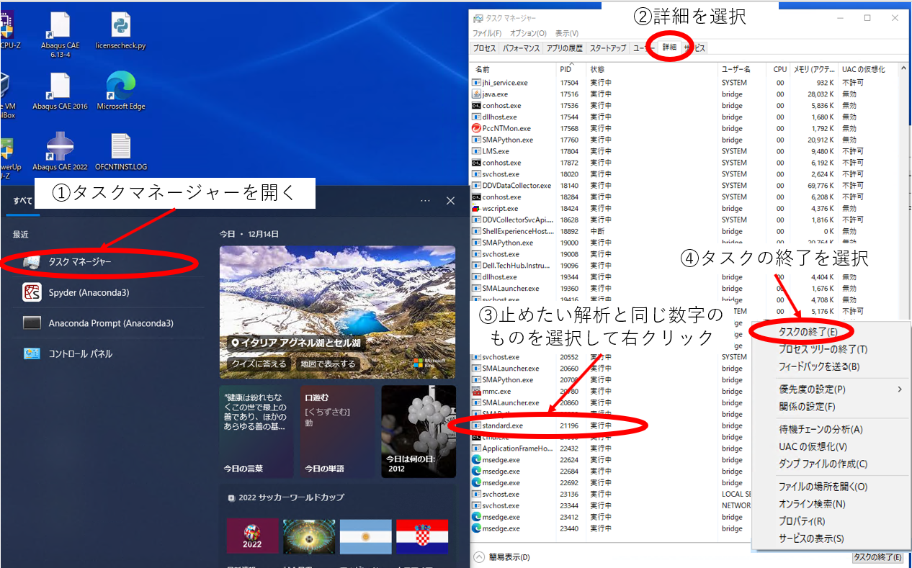

# 解析の流し方と止め方

# 流し方

## license状況

 

 ※2023年2月29日まで，上記が適用される

## ルール

1．licenseの空き状況を確認してから解析を流し，流した後にも自分の解析がきちんと流れているか確認する

2．BRABQ8~10の「共有76license」または「共有120license」のフォルダでのみ解析を流してよい

3．基本的に1人の人が同時に使用できるフォルダーは1つまで(同じフォルダであれば，連続して流してよい)

4．解析を流し終えたら，使用したフォルダ内の出力ファイルを消去する

5．inpファイルの名前は，job3など初期設定にせず，必ず自分で名前を設定する(他の人と区別するため)

6．データチェック用に50licenseは残しておく

## 流し方

1．「abaqus licensing.bat」または「BRWIKI Index 解析」でlicenseの空き状況を確認する

2．BRABQ8~10の「共有76license」または「共有120license」フォルダにアクセスする

3．アクセスしたフォルダにコピーしたinpファイルを貼り付ける

4．実行スクリプトをダブルクリックする(誰かの解析がすでに流れている場合は何もしなくてよい)

5．「abaqus licensing.bat」または「BRWIKI Index 解析」で自分が使用しているはずのlicenseが使用されているか確認する

# 止め方

1．止めたい解析を流しているBRABQにアクセスする

2．デスクトップ画面にある「タスクのPID取得.bat」をクリックする

3．自分の流した日時か確認し，一番後ろの数字を覚える

4．タスクマネージャーを開き，詳細を選択する

5．止めたい解析の数字と同じPIDのものを選択して右クリックする

6．タスクの終了を選択する

7．デスクトップ画面にある「タスクのPID取得.bat」と「abaqus licensing.bat」または「BRWIKI Index 解析」を見て自分の解析がなくなっているのを確認する

