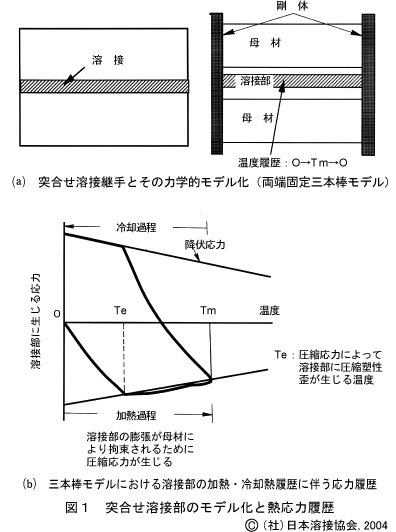

# ABAQUSにおける溶接残留応力の表現

# 溶接残留応力とは

熱が加えられると，多くの物体は膨張しようとする。このように熱は変形させる外力と同じ働きをすると言える。均質な物体が一様に加熱されるときには，自由に膨張し，しかもその変形は等方的である。しかし，溶接のように接合する部分のみが局部的に加熱されるような場合，その膨張が周囲の材料によって妨げられ，物体内に「熱応力（thermal stress)」が生じる。その熱応力が残留応力をもたらす原因となる。  

通常の鋼溶接部では溶接部近傍のみが加熱・冷却されるが，それによって生じる膨張・収縮の熱変形が周りの母材によって拘束されるため，基本的な変形挙動は，図１に示すように両端固定三本棒モデルの変形・応力挙動と同じとなる。通常の鋼材は温度とともに降伏応力は小さくなり，加熱途中で材料に圧縮の塑性変形が生じることになる。すなわち，この圧縮の塑性歪のために，冷却された後では溶接部のみ棒の長さが短くなることになるが，溶接部と母材はくっついているために，周りの母材に引張られる結果，鋼溶接部近傍には引張りの残留応力が生じることになる。

>すなわち，溶接部に相当する部材が一定の温度まで加熱し冷却されるときには，図中に示すように加熱過程で圧縮の応力と塑性歪が生じ，冷却過程で引張応力へと変わって，最終的に引張残留応力生じることになる。

# ABAQUSにおける表現方法

## 材料特性

### 材料挙動
弾性，金属塑性etc...

＋

伝導率→熱的，鉄は80(W/m・k)

熱膨張→機械的，鉄は12.1(10^-6/m・k)

### ステップタイプ
Coupled temp-displacementを選択

温度の場と応力/変位の場の関係を同時に解析できる

### 境界条件

### 要素タイプ
温度₋変位連成を選択

## 結果

# Reference

- 