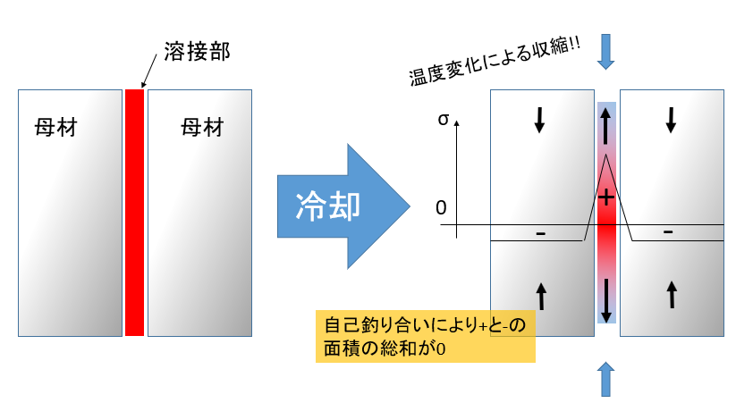
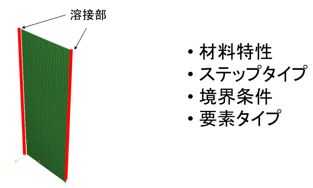
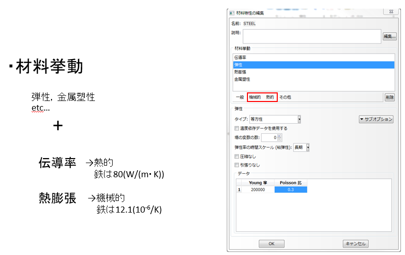
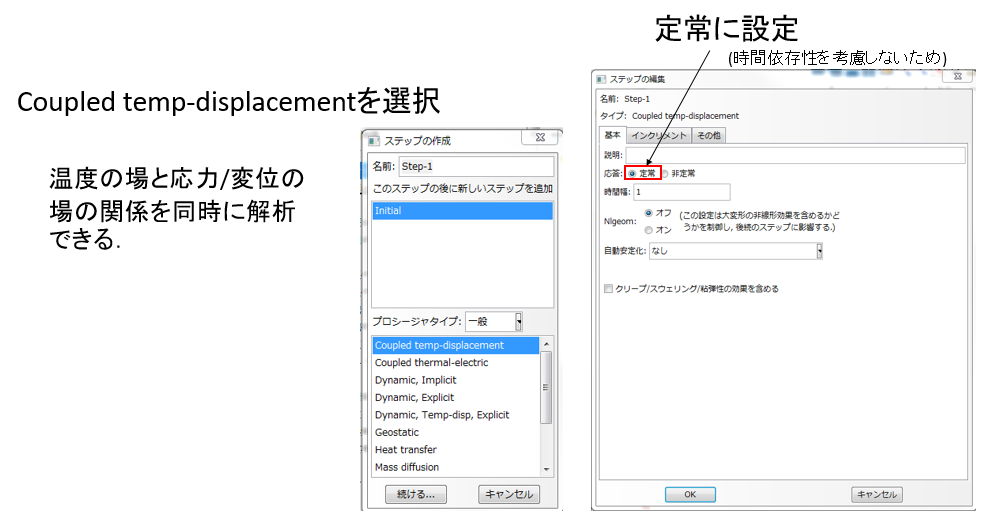
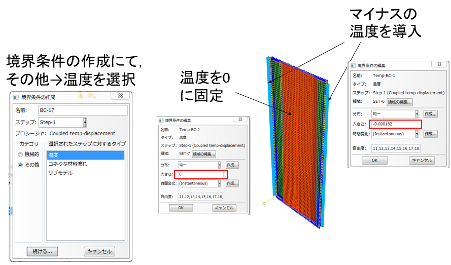
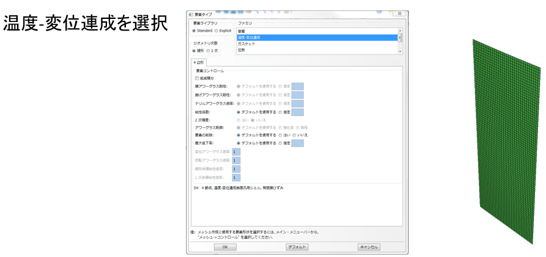
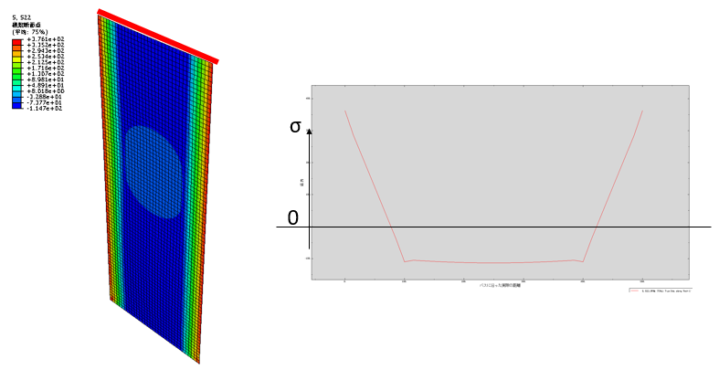

# ABAQUSにおける溶接残留応力の表現

# 溶接残留応力とは
母材と母材を溶接した溶接部が冷却する際に，温度変化によって収縮することで発生する応力のこと．

# ABAQUSにおける表現方法

## 材料特性

### 材料挙動
弾性，金属塑性etc...

＋

伝導率→熱的，鉄は80(W/m・k)

熱膨張→機械的，鉄は12.1(10^-6/m・k)

### ステップタイプ
Coupled temp-displacementを選択

温度の場と応力/変位の場の関係を同時に解析できる

### 境界条件

### 要素タイプ
温度₋変位連成を選択

## 結果

