# ひずみゲージ
## ひずみゲージとは

ひずみゲージは、薄い電気絶縁物のベースの上に格子状の抵抗線またはフォトエッチング加工した抵抗箔を形成し、引出線（ゲージリード）を付けたもの。これを測定対象物（供試体）の表面に専用接着剤で接着して測定する。
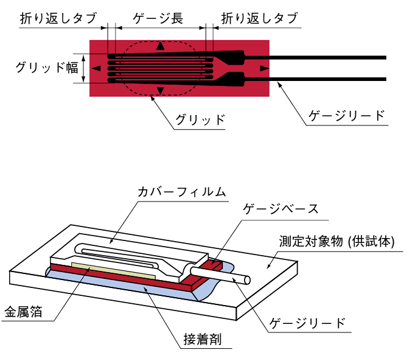

## ひずみ測定方式
測定対象物にひずみが発生すると、ひずみゲージのベースを経由して抵抗体にひずみが伝わってきる。発生したひずみに対応した抵抗変化とひずみの関係は次式のようになる。
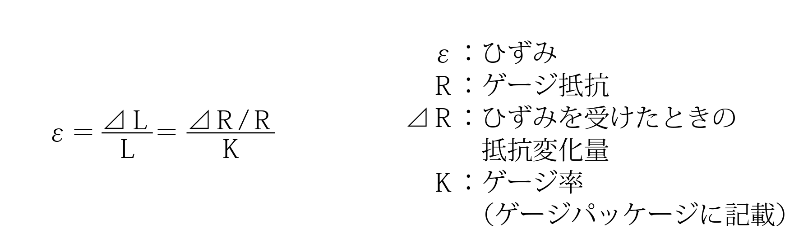

ひずみゲージの抵抗変化は微小な値ですのでホイートストンブリッジ回路を用いて電圧に変換しする。
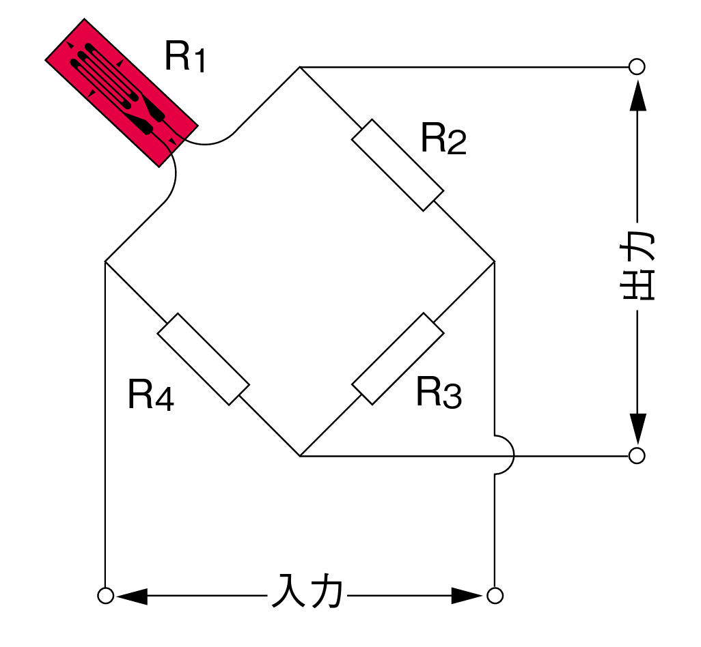

**ブリッジ回路の出力電圧は**

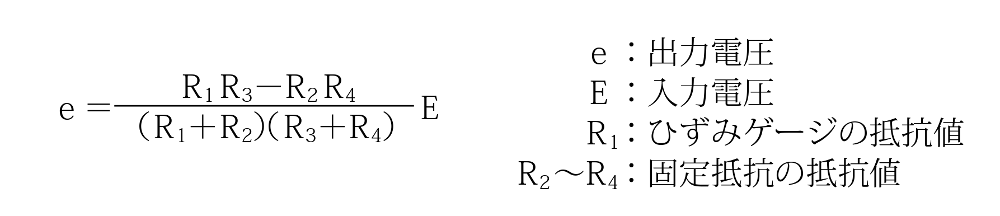

$R=R_1=R_2=R_3=R_4$とするとひずみゲージにひずみが加わってひずみゲージの抵抗Rが$R+⊿R$になり.
したがって、ひずみによる出力電圧$\Delta e$（変化分）は
$$
\Delta e=\frac{\Delta R}{4 R+2 \Delta R} E
$$
$\Delta e \ll R$ の場合
$$
\Delta e=\frac{\Delta R}{4 R} E=\frac{e}{4} \mathrm{~K} \varepsilon
$$

**計測目的別ゲージ長の例**

パイプや丸棒など細い測定対象物の場合は、幅の狭いひずみゲージを用いるなど、測定対象物の材質や、計測目的に合った長さ・幅のひずみゲージを選ぶ．

|場合|ゲージ長さ|
|--|--|
|衝撃など高速の現象やR面、応力が集中する面の場合|0.2～1㎜|
|金属・プラスチックを計測する場合|2～10㎜程度|
|木材・複合材料を計測する場合|10～20㎜程度|
|コンクリートを計測する場合|30㎜以上（砂利粒径の3倍以上）|

# 1ゲージ法
ブリッジ回路の一辺にひずみゲージが、他の三辺に固定抵抗が接続される回路

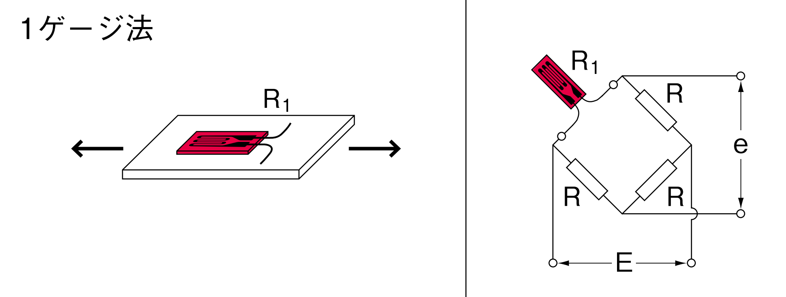

 簡単な為、一般の応力・ひずみ測定に 広く使われる


ひずみゲージ測定には使用するひずみゲージの枚数や測定の目的に応じて各種の結線方法が用いられています。1ゲージ法ではリー ド線抵抗の温度影響をなくすために1ゲージ法3線式が広く用いられています。

>問題点： 
リード線抵抗によるゲージ率の補正や接続部の接触抵抗の変動などによる測定誤差が生じる.

## 1ゲージ２線式結線法
最も⼀般的な接続⽅法です。

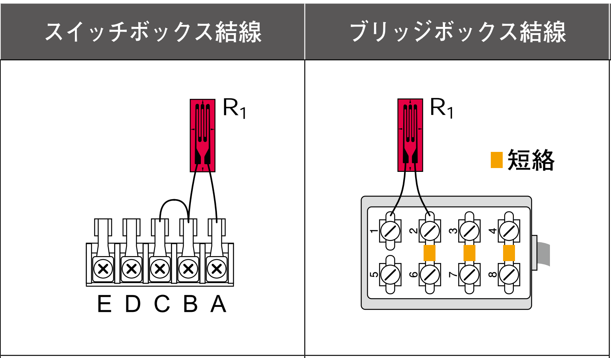

## 1ゲージ3線式結線法
温度によるリード線抵抗変化分を補償する。
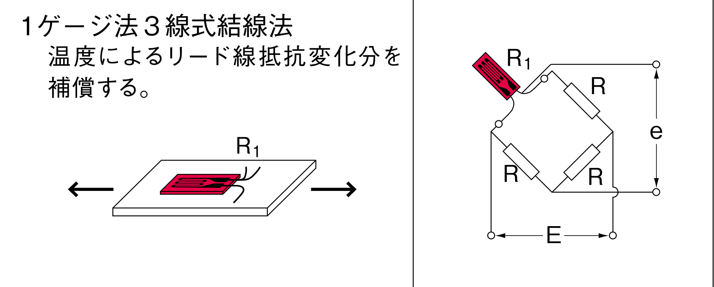
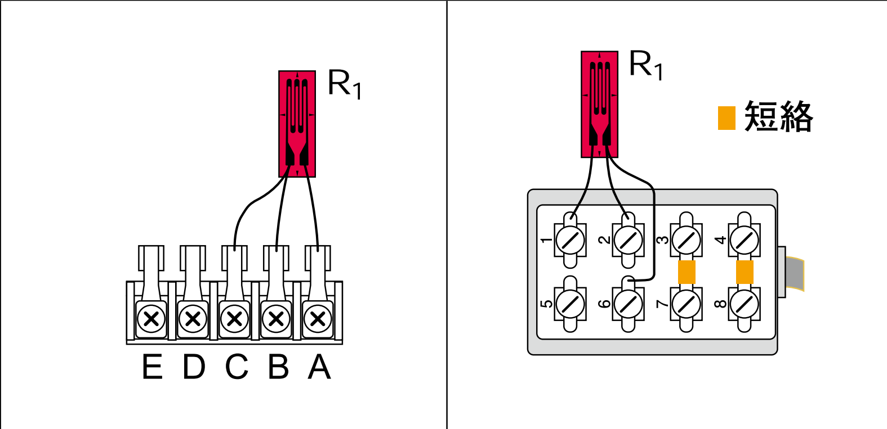

## 1ゲージ4線式結線法

**東京測器開発の1ゲージ4線式ひずみ測定法**

>4本のリード線を用いることでリー ド線抵抗によるゲージ率の補正や接触抵抗による測定誤差が生じない新方式のひずみ測定方法

細いリード線や簡易型コネクタ（モジュラープラグ）を用いることができるため配線作業の効率化と配線ミスの防止、リード線の再利用などひずみ測定のコストダウンが実現できます。
また、はんだ付け作業が不要になるので鉛フリーと併せ配線材料の省資源化も 実現できる

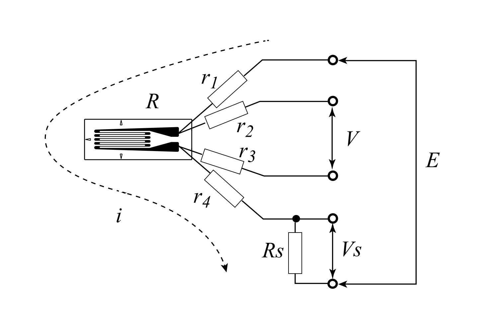

### 1ゲージ法3線式に対する優位性

- **リード線抵抗**
- 
リード抵抗の影響を全く受けないので細いリード線を長くひずみゲージに付加することが可能. **1ゲージ法3線式と1ゲージ4線式ひずみ測定法の比較リード線抵抗値変化の影響を受けない特長.**
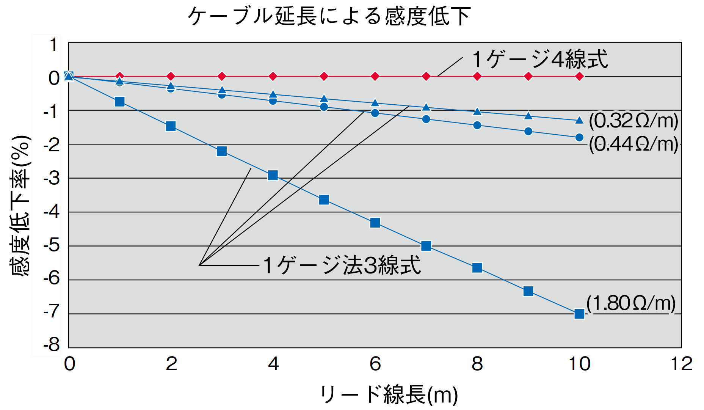

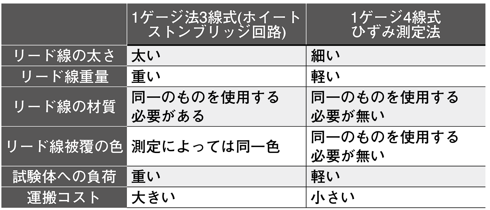

- **リード線による熱出力の影響が無い**
- 
断面積0.11mm2のリード線10mを用いて1ゲージ法で測定を行った場合、測定中に温度変化があると約50×10−6/℃の見かけひずみが発生するため、補正が必要。また、1ゲージ法3線式の場合でも3本のリード線の種類や長さ、断面積、温度環境が異なると補正が必要。**1ゲージ4線式ひずみ測定法では、これらの条件でも補正を行う必要がない。**
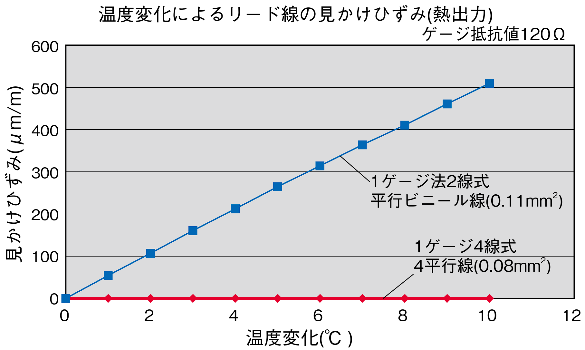

- **結線方法**

>1ゲージ法3線式と1ゲージ4線式ひずみ測定法の比較接続部の接触抵抗値変化の影響を受けない特長

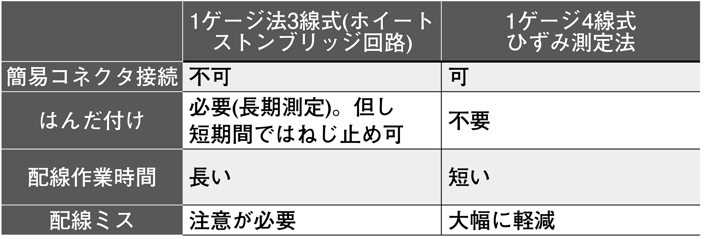

# 補足
$E:$ 入力電圧  
$e$ : 出力電圧  
$\triangle e:$ ひずみによる出力電圧  
$e_0$ : ひずみ発生前の出力電圧  
$R_0$ : ひずみ発生前の抵抗  
$\triangle R$ : ひずみによる抵抗変化  
$\varepsilon:$ ひずみ量  
$\mathrm{K}$ : ゲージ率  
$e=e_0+\Delta e$  
$R_1=R_0+\Delta R$  
$R=R_0$  
$\Delta e=\frac{E}{4} \mathrm{K \varepsilon}$  

## 角度誤差を補正する

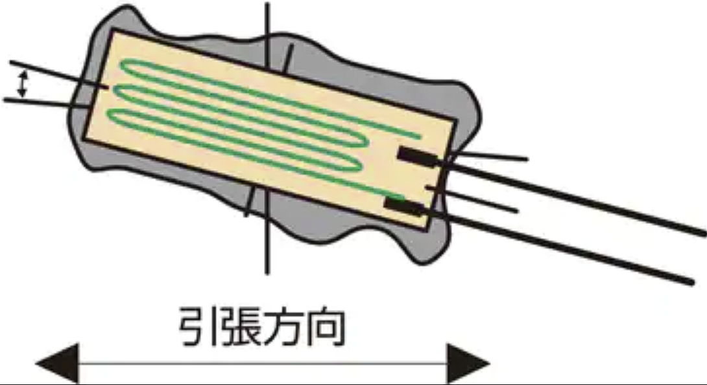

ひずみの方向とひずみゲージの方向が5°ずれると約1％の誤差が発生する。けがき線と貼り付け方向がずれた場合、ポアソン比（ν）を用いスケーリングして補正できる。

$$
\epsilon＝\epsilon_0\{(1-ν)+(1+ν)cos2\theta\}/2
$$
金属の場合，一般的にポアソン比は0.3程度なので
$$
\epsilon＝\epsilon_0(0.7+1.3cos2\theta)/2　$$
$$
\epsilon_0＝2\epsilon/(0.7+1.3cos2\theta)
$$

|||||||
|-|-|-|-|-|-|
|角度|1°|2°|3°|4°|5°|
|誤差|0.03%| 0.16%|0.36%|0.64%|1.00%|

# 金額
ひずみゲージ部分の金額は同じ　　
リード線部分の金額でひずみゲージ全体の値段が決まる

|種類|単価|
|--|--|
|１ゲージ２線式（リード線長さ：1m）　|３９０円|
|１ゲージ３線式（リード線なし，FLAB-5-11-3LH-F）　|４９０円|
|１ゲージ４線式（リード線長さ:1m，モジュールプラグ付き）|６００円|

# 参考文献
- [1ゲージ法の種類](https://www.tokyo-sensor.co.jp/tech/1gauge.html)
- [一軸ゲージ法―東京測器研究所](https://tml.jp/documents/strain_gauge/bridge_list.pdf)
- [一軸ゲージ法4線―東京測器研究所](https://tml.jp/documents/strain_gauge/1gauge4.pdf)
- https://www.keyence.co.jp/ss/products/recorder/lab/strain/straingage.jsp
- https://tml.jp/documents/strain_gauge/what_straingauge3.pdf